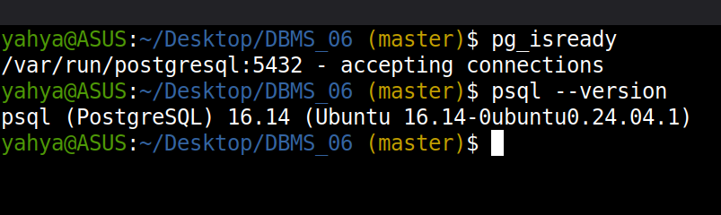
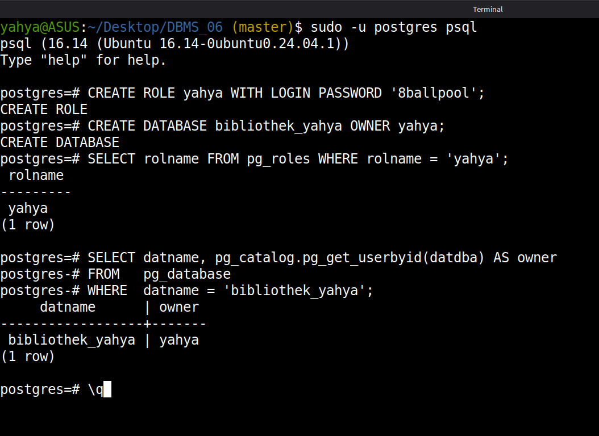
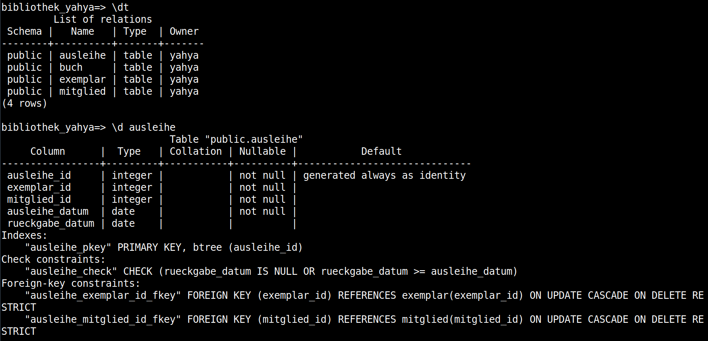
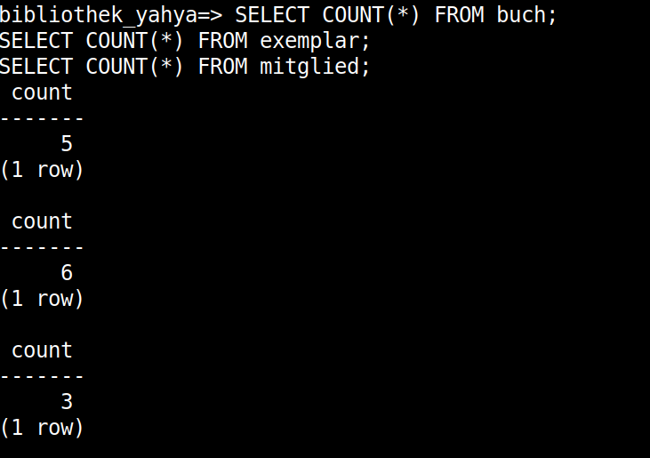
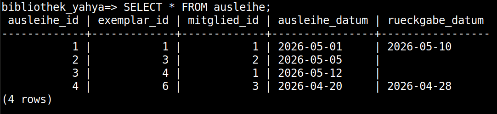
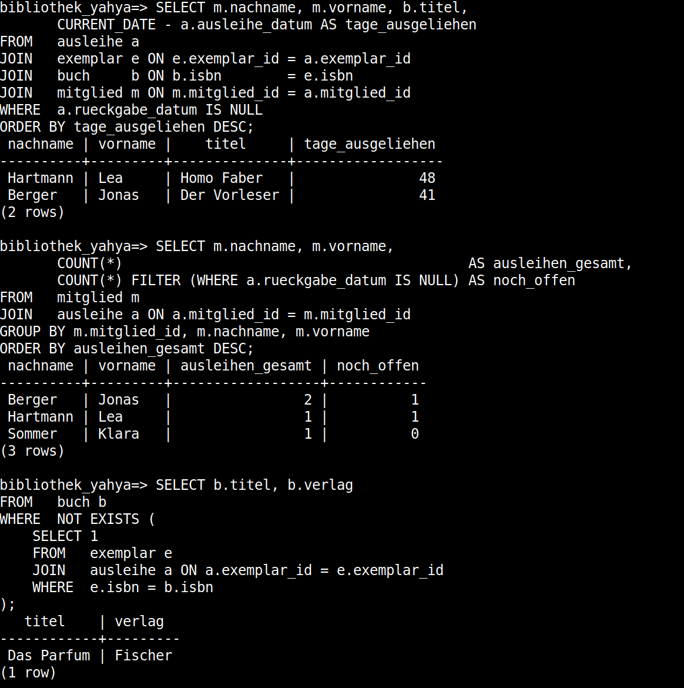
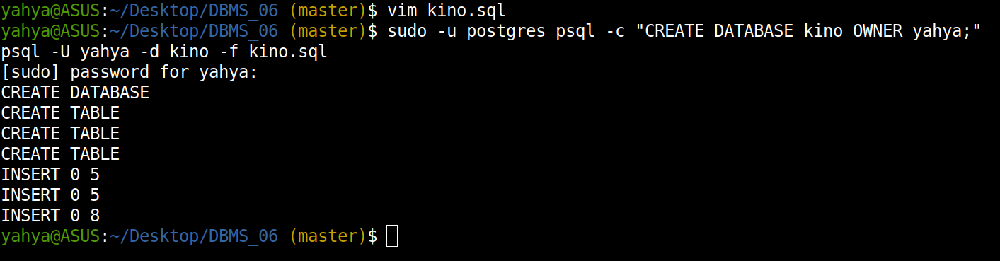
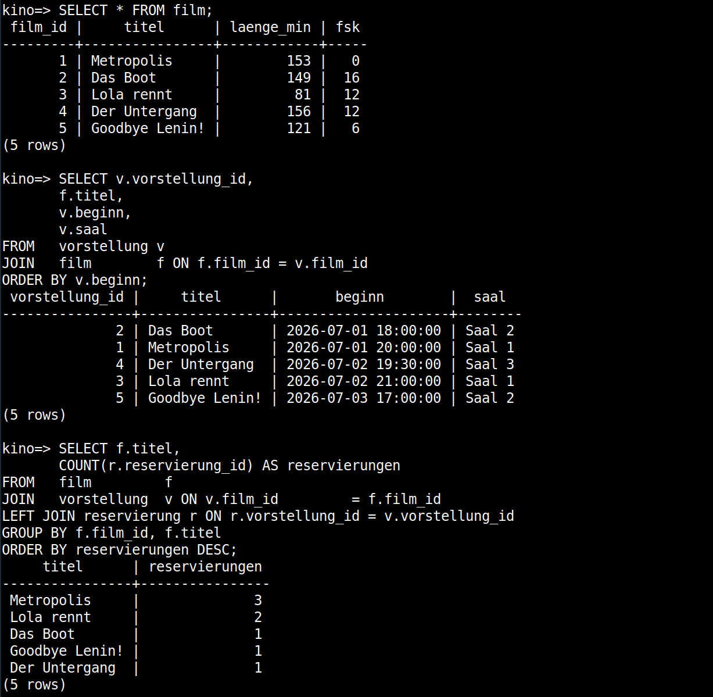

# DBMS_06 – PostgreSQL in Practice: DDL, DML, and Bulk Import

**Module:** Databases · THGA Bochum  
**Lecturer:** Stephan Bökelmann · <sboekelmann@ep1.rub.de>  
**Repository:** <https://github.com/MaxClerkwell/DBMS_06>  
**Prerequisites:** DBMS_01, DBMS_02, DBMS_03, DBMS_04, DBMS_05, Lecture 06  
**Duration:** 90 minutes

---

## Learning Objectives

After completing this exercise you will be able to:

- Connect to a remote Linux server via **SSH** and work confidently in a
  terminal-only environment
- Verify that a running PostgreSQL instance is available and understand the
  role of the `postgres` system user
- Create a **database user** and a **database** using standard SQL commands
  from the `psql` client
- Re-implement a known relational schema in PostgreSQL by typing **DDL
  statements** interactively in `psql`
- Insert rows **one at a time** using `INSERT` and observe immediate feedback
  from the database engine
- Prepare a **CSV file by hand** and load its contents into a table using
  the standard SQL `COPY` statement
- Formulate and run **three analytical queries** directly in the `psql` shell
- Create and populate a second, independent database entirely from a
  **`.sql` script**

**After completing this exercise you should be able to answer the following questions independently:**

- What is the difference between the `postgres` operating-system user and a
  PostgreSQL database role?
- Why must foreign keys be defined in dependency order when creating tables?
- What are the advantages of `COPY FROM` over individual `INSERT` statements
  for large data volumes?
- What does `\q`, `\dt`, `\d <table>`, and `\c <database>` do inside `psql`?

---

## 0 – Connect to the Server

You can complete this exercise either on the **THGA lecture server** or on
**your own machine** running a Debian-based Linux distribution (Ubuntu, Debian,
WSL2, etc.).

### Option A – Lecture Server (SSH)

```bash
ssh <your-username>@<server-ip>
```

> You should see a shell prompt on the remote machine.
> If you are asked about the host fingerprint, type `yes` and press Enter.

> **Screenshot 1:** Take a screenshot of your terminal showing a successful
> SSH login (the welcome banner and your shell prompt) and insert it here.
>
> 


### Option B – Your Own Machine

Open a terminal. All subsequent commands run locally — skip the `ssh` step.

---

## 1 – Verify PostgreSQL is Available

### Option A – Lecture Server

PostgreSQL is already installed and running on the lecture server. Just
confirm that the service is reachable and check the client version:

```bash
pg_isready
psql --version
```

> `pg_isready` should print something like
> `/var/run/postgresql:5432 - accepting connections`.

### Option B – Your Own Machine

If you are working on your own Debian-based system, install PostgreSQL first:

```bash
sudo apt-get update
sudo apt-get install -y postgresql postgresql-client
```

Then verify:

```bash
pg_isready
psql --version
```

> **Screenshot 2:** Take a screenshot showing the output of both commands.
>
> 

---

## 2 – Create a Database User and a Database

PostgreSQL uses the concept of **roles** for access control. After installation,
only the `postgres` superuser role exists. You will create a dedicated role for
this exercise and assign a new database to it.

Switch to the `postgres` system user to open a superuser session:

```bash
sudo -u postgres psql
```

You should now see the `psql` prompt:

```
psql (16.x)
Type "help" for help.

postgres=#
```

Create your role (replace `<your-username>` with your actual Unix login name
so that you can connect without specifying `-U` later):

```sql
CREATE ROLE <your-username> WITH LOGIN PASSWORD '<choose-a-password>';
```

Create the database and assign ownership to your new role:

```sql
CREATE DATABASE bibliothek_<your-username> OWNER <your-username>;
```

Verify:

```sql
SELECT rolname FROM pg_roles WHERE rolname = '<your-username>';
SELECT datname, pg_catalog.pg_get_userbyid(datdba) AS owner
FROM   pg_database
WHERE  datname = 'bibliothek_<your-username>';
```

Exit the superuser session:

```sql
\q
```

> **Screenshot 3:** Take a screenshot showing the `CREATE ROLE`, `CREATE DATABASE`,
> and both `SELECT` results inside the `postgres=#` session.
>
> 

---

## 3 – Connect as Your Own User

```bash
psql -U <your-username> -d bibliothek_<your-username>
```

You should see:

```
psql (16.x)
Type "help" for help.

bibliothek=>
```

> From this point on, every `psql` session in this exercise connects with
> `psql -U <your-username> -d bibliothek_<your-username>` unless stated otherwise.

---

## 4 – Create the Schema

You will now recreate the **municipal library** schema from DBMS_05 in
PostgreSQL. Type each statement individually and press Enter to execute it.
Do not paste all statements at once.

The schema consists of four tables:

| Table      | Description                                      |
|------------|--------------------------------------------------|
| `buch`     | Books, identified by ISBN                        |
| `exemplar` | Physical copies of a book                        |
| `mitglied` | Library members                                  |
| `ausleihe` | Lending transactions (copy ↔ member)             |

Type and execute the following statements one by one:

```sql
CREATE TABLE buch (
    isbn              TEXT           PRIMARY KEY,
    titel             TEXT           NOT NULL,
    erscheinungsjahr  INTEGER        NOT NULL,
    verlag            TEXT           NOT NULL,
    tagesgebuehr      NUMERIC(6,2)   NOT NULL CHECK (tagesgebuehr > 0)
);
```

```sql
CREATE TABLE exemplar (
    exemplar_id  INTEGER  PRIMARY KEY,
    isbn         TEXT     NOT NULL,
    standort     TEXT     NOT NULL,
    FOREIGN KEY (isbn) REFERENCES buch(isbn)
        ON DELETE RESTRICT ON UPDATE CASCADE
);
```

```sql
CREATE TABLE mitglied (
    mitglied_id     INTEGER      PRIMARY KEY GENERATED ALWAYS AS IDENTITY,
    nachname        TEXT         NOT NULL,
    vorname         TEXT         NOT NULL,
    geburtsdatum    DATE         NOT NULL,
    email           TEXT         NOT NULL UNIQUE,
    beitritt_datum  DATE         NOT NULL DEFAULT CURRENT_DATE
);
```

```sql
CREATE TABLE ausleihe (
    ausleihe_id      INTEGER  PRIMARY KEY GENERATED ALWAYS AS IDENTITY,
    exemplar_id      INTEGER  NOT NULL,
    mitglied_id      INTEGER  NOT NULL,
    ausleihe_datum   DATE     NOT NULL,
    rueckgabe_datum  DATE,
    FOREIGN KEY (exemplar_id) REFERENCES exemplar(exemplar_id)
        ON DELETE RESTRICT ON UPDATE CASCADE,
    FOREIGN KEY (mitglied_id) REFERENCES mitglied(mitglied_id)
        ON DELETE RESTRICT ON UPDATE CASCADE,
    CHECK (rueckgabe_datum IS NULL OR rueckgabe_datum >= ausleihe_datum)
);
```

Verify that all four tables were created:

```sql
\dt
```

Inspect the structure of one table:

```sql
\d ausleihe
```

> **Screenshot 4:** Take a screenshot showing the output of `\dt` and
> `\d ausleihe`.
>
> 

### Questions for Section 4

**Question 4.1:** You had to create `buch` before `exemplar`, and `exemplar`
and `mitglied` before `ausleihe`. Why does this order matter? What error would
PostgreSQL report if you tried to create `ausleihe` first?

> The relationship Parent-Son requires the parents to be created first. Creating ausleihe for example first would trigger an error like `relation "exemplar" does not exist`.

**Question 4.2:** The `mitglied_id` and `ausleihe_id` columns use
`GENERATED ALWAYS AS IDENTITY`. What does this mean? What happens if you try to
supply a value explicitly with `INSERT INTO mitglied (mitglied_id, ...) VALUES (5, ...)`?

> The expression `GENERATED ALWAYS AS IDENTITY` assigns the value automatically. So providing the `VALUES (5, ...)` flags an error (`cannot insert a non-DEFAULT value into column "mitglied_id"`)

**Question 4.3:** `tagesgebuehr` is defined as `NUMERIC(6,2)` while a simpler
`REAL` would also hold decimal numbers. Give a concrete example of an arithmetic
result that would differ between the two types when calculating a lending fee.

> Example: 7 days * 0,20$/day. With `NUMERIC` the reslt is exactly `1,40`. With `REAL`, the `0,20` is not exactly representable, so the result may come out `1,39999...`

---

## 5 – Insert Rows One at a Time

Insert each of the following rows by typing the `INSERT` statement manually and
executing it individually. Watch the `INSERT 0 1` confirmation after each one.

**Books:**

```sql
INSERT INTO buch VALUES ('978-3-423-08733-2', 'Steppenwolf', 1927, 'dtv', 0.50);
```

```sql
INSERT INTO buch VALUES ('978-3-518-36893-4', 'Homo Faber', 1957, 'Suhrkamp', 0.50);
```

```sql
INSERT INTO buch VALUES ('978-3-257-20456-6', 'Der Vorleser', 1995, 'Diogenes', 0.75);
```

```sql
INSERT INTO buch VALUES ('978-3-596-18296-4', 'Das Parfum', 1985, 'Fischer', 0.75);
```

```sql
INSERT INTO buch VALUES ('978-3-423-13571-9', 'Die Verwandlung', 1915, 'dtv', 0.30);
```

**Copies:**

```sql
INSERT INTO exemplar VALUES (1, '978-3-423-08733-2', 'A-01-3');
```

```sql
INSERT INTO exemplar VALUES (2, '978-3-423-08733-2', 'A-01-4');
```

```sql
INSERT INTO exemplar VALUES (3, '978-3-518-36893-4', 'A-02-1');
```

```sql
INSERT INTO exemplar VALUES (4, '978-3-257-20456-6', 'B-01-7');
```

```sql
INSERT INTO exemplar VALUES (5, '978-3-596-18296-4', 'B-02-2');
```

```sql
INSERT INTO exemplar VALUES (6, '978-3-423-13571-9', 'A-03-1');
```

**Members** — omit `mitglied_id` (it is generated) and omit `beitritt_datum`
for the first two members to test the `DEFAULT`:

```sql
INSERT INTO mitglied (nachname, vorname, geburtsdatum, email)
VALUES ('Berger', 'Jonas', '2001-04-12', 'jonas.berger@mail.de');
```

```sql
INSERT INTO mitglied (nachname, vorname, geburtsdatum, email)
VALUES ('Hartmann', 'Lea', '1998-07-08', 'lea.hartmann@example.com');
```

```sql
INSERT INTO mitglied (nachname, vorname, geburtsdatum, email, beitritt_datum)
VALUES ('Sommer', 'Klara', '1985-11-30', 'klara.sommer@web.de', '2019-03-15');
```

After all inserts, verify the row count:

```sql
SELECT COUNT(*) FROM buch;
SELECT COUNT(*) FROM exemplar;
SELECT COUNT(*) FROM mitglied;
```

> **Screenshot 5:** Take a screenshot showing the three `COUNT(*)` results.
>
> 

Exit `psql`:

```sql
\q
```

---

## 6 – Create a CSV File and Load It with COPY

You will now add the lending records (`ausleihe`) not by hand, but by preparing
a CSV file and loading it with the standard SQL `COPY` statement.

### Step 1 – Write the CSV File

Open a new file in the terminal:

```bash
vim ausleihe.csv
```

Enter Insert mode with `i` and type the following content exactly — one row
per line, fields separated by commas, no header row:

```
1,2026-05-01,2026-05-10
2,2026-05-05,
3,2026-05-12,
6,2026-04-20,2026-04-28
```

The columns correspond to: `exemplar_id`, `ausleihe_datum`, `rueckgabe_datum`.
An empty trailing field means `NULL`.

Save and exit: press `Esc`, then type `:wq` and press Enter.

Verify the file:

```bash
cat ausleihe.csv
```

> Note: `mitglied_id` is not in the CSV. You will specify the target columns
> in the `COPY` statement and use a fixed value via a subsequent `UPDATE`, or
> you can extend the CSV to include the member assignment. The approach below
> adds `mitglied_id` to the CSV as a fourth column (member IDs: 1, 2, 1, 3).
> Recreate the file accordingly:

```
1,1,2026-05-01,2026-05-10
3,2,2026-05-05,
4,1,2026-05-12,
6,3,2026-04-20,2026-04-28
```

Columns: `exemplar_id`, `mitglied_id`, `ausleihe_datum`, `rueckgabe_datum`.

### Step 2 – Load the CSV

Connect to the database:

```bash
psql -U <your-username> -d bibliothek
```

Load the file using `COPY`. The path must be absolute:

```sql
COPY ausleihe (exemplar_id, mitglied_id, ausleihe_datum, rueckgabe_datum)
FROM '/home/<your-username>/ausleihe.csv'
WITH (FORMAT csv, NULL '');
```

> The `NULL ''` option tells PostgreSQL to interpret an empty field as `NULL`.

Verify:

```sql
SELECT * FROM ausleihe;
```

> **Screenshot 6:** Take a screenshot showing the full output of `SELECT * FROM ausleihe`.
>
> 

### Questions for Section 6

**Question 6.1:** `COPY FROM` requires an absolute path on the server's
filesystem. What is the difference between server-side `COPY` and a
client-side import? In which scenario would you need the client-side variant?

> Server-side COPY reads a file on the database server's filesystem. The client-side variant reads a file on your local machine and streams it over the connection. The client-side variant is to use, when the server's shell is unaccessible or when the file is stored only in the local machine

**Question 6.2:** The `NULL ''` option maps empty CSV fields to `NULL`.
What would happen without this option if the `rueckgabe_datum` field is empty?

> Without NULL '', an empty field is read as an empty string ''. Since rueckgabe_datum is a DATE, PostgreSQL would try to cast '' to a date and fail with an invalid input syntax for type date error.

**Question 6.3:** `ausleihe_id` is `GENERATED ALWAYS AS IDENTITY` and was not
included in the CSV or the `COPY` column list. How does PostgreSQL handle the
missing value? What would happen if you tried to include `ausleihe_id` in the
`COPY` column list with explicit values?

> `ausleihe_id` is auto-generated from the identity sequence for each loaded row, just like with `INSERT`. Including it in the COPY column list values fails the same way as in Q4.2 (`cannot insert a non-DEFAULT value into a GENERATED ALWAYS column`).

---

## 7 – Three Queries in the psql Shell

Type and execute each query individually in the `psql` shell. Activate
formatted output first:

```sql
\pset format aligned
\pset border 1
```

---

### Query 1 – Currently Open Loans

List all loans that have not yet been returned: show the member's full name
(last name, first name), the book title, and the number of days the book has
been borrowed so far (today minus `ausleihe_datum`).

```sql
SELECT m.nachname,
       m.vorname,
       b.titel,
       CURRENT_DATE - a.ausleihe_datum AS tage_ausgeliehen
FROM   ausleihe   a
JOIN   exemplar   e ON e.exemplar_id = a.exemplar_id
JOIN   buch       b ON b.isbn        = e.isbn
JOIN   mitglied   m ON m.mitglied_id = a.mitglied_id
WHERE  a.rueckgabe_datum IS NULL
ORDER BY tage_ausgeliehen DESC;
```

> *Describe the result: how many open loans are there, and which member has
> held a book the longest?*
>
> *Result*: 2 open loans. The one borrowed earliest (2026-05-05) has been out longest.

---

### Query 2 – Loans per Member

For each member, show their full name, the total number of loans, and the
number of loans that are still open. Sort descending by total loans.

```sql
SELECT m.nachname,
       m.vorname,
       COUNT(*)                                          AS ausleihen_gesamt,
       COUNT(*) FILTER (WHERE a.rueckgabe_datum IS NULL) AS noch_offen
FROM   mitglied m
JOIN   ausleihe a ON a.mitglied_id = m.mitglied_id
GROUP BY m.mitglied_id, m.nachname, m.vorname
ORDER BY ausleihen_gesamt DESC;
```

> *Which member has the most loans? What does `FILTER (WHERE ...)` do here
> compared to a `CASE WHEN` expression?*
>
> *Result*: Berger (id 1) has 2 loans; Hartmann and Sommer have 1 each. FILTER (WHERE ...) counts only rows matching the condition inside an aggregate, is however cleaner than SUM(CASE WHEN ... THEN 1 ELSE 0 END) and reads more directly.

---

### Query 3 – Books That Have Never Been Borrowed

Return the title and publisher of every book for which no lending record
exists anywhere in `ausleihe` (regardless of return date).

```sql
SELECT b.titel,
       b.verlag
FROM   buch b
WHERE  NOT EXISTS (
    SELECT 1
    FROM   exemplar e
    JOIN   ausleihe a ON a.exemplar_id = e.exemplar_id
    WHERE  e.isbn = b.isbn
);
```

> *Which books appear in the result? Verify the result manually against the
> data you entered.*
>
> *Result*: Books whose copies were never lent.

> **Screenshot 7:** Take a screenshot showing the output of all three queries
> in sequence in the `psql` shell.
>
> 

### Questions for Section 7

**Question 7.1:** Query 1 joins four tables. In what order must the joins be
performed to always produce a correct result, and does the join order affect
correctness or only performance?

> Logically the joins resolve ausleihe → exemplar → buch and ausleihe → mitglied. Join order does not affect correctness for inner joins; the result set is the same. The planner may reorder joins purely for performance.

**Question 7.2:** Query 2 groups by `m.mitglied_id` in addition to the name
columns. Why is grouping by the primary key necessary even though names appear
unique in the sample data?

> You group by mitglied_id because it's the primary key and guarantees one group per real member. Grouping only by name would merge two different members who happen to share a name. Including the key is also required so the non-aggregated name columns are functionally dependent on the grouping key.

**Question 7.3:** Query 3 uses `NOT EXISTS` with a correlated subquery. Rewrite
the query using `EXCEPT` and verify that both variants return the same result.
Write your rewritten query here:

> *Your rewritten query:*
```sql
SELECT b.titel, b.verlag FROM buch b
EXCEPT
SELECT b.titel, b.verlag
FROM   buch b
JOIN   exemplar e ON e.isbn = b.isbn
JOIN   ausleihe a ON a.exemplar_id = e.exemplar_id;
```


Exit `psql`:

```sql
\q
```

---

## 8 – A Second Database from a Script

You will now create a new, independent database for a different domain: a
small **cinema programme** that stores films, screenings, and seat reservations.

### Step 1 – Create the Script File

```bash
vim kino.sql
```

Enter the following content:

```sql
-- Create the database (run this outside a transaction, directly in psql)
-- The database is created manually; this script sets up the schema and data.

CREATE TABLE film (
    film_id     INTEGER      PRIMARY KEY GENERATED ALWAYS AS IDENTITY,
    titel       TEXT         NOT NULL,
    laenge_min  INTEGER      NOT NULL CHECK (laenge_min > 0),
    fsk         INTEGER      NOT NULL CHECK (fsk IN (0, 6, 12, 16, 18))
);

CREATE TABLE vorstellung (
    vorstellung_id  INTEGER   PRIMARY KEY GENERATED ALWAYS AS IDENTITY,
    film_id         INTEGER   NOT NULL,
    beginn          TIMESTAMP NOT NULL,
    saal            TEXT      NOT NULL,
    FOREIGN KEY (film_id) REFERENCES film(film_id)
        ON DELETE RESTRICT ON UPDATE CASCADE
);

CREATE TABLE reservierung (
    reservierung_id  INTEGER  PRIMARY KEY GENERATED ALWAYS AS IDENTITY,
    vorstellung_id   INTEGER  NOT NULL,
    sitzplatz        TEXT     NOT NULL,
    name_gast        TEXT     NOT NULL,
    FOREIGN KEY (vorstellung_id) REFERENCES vorstellung(vorstellung_id)
        ON DELETE CASCADE ON UPDATE CASCADE,
    UNIQUE (vorstellung_id, sitzplatz)
);

-- Sample data
INSERT INTO film (titel, laenge_min, fsk) VALUES
    ('Metropolis',         153, 0),
    ('Das Boot',           149, 16),
    ('Lola rennt',          81, 12),
    ('Der Untergang',      156, 12),
    ('Goodbye Lenin!',     121, 6);

INSERT INTO vorstellung (film_id, beginn, saal) VALUES
    (1, '2026-07-01 20:00', 'Saal 1'),
    (2, '2026-07-01 18:00', 'Saal 2'),
    (3, '2026-07-02 21:00', 'Saal 1'),
    (4, '2026-07-02 19:30', 'Saal 3'),
    (5, '2026-07-03 17:00', 'Saal 2');

INSERT INTO reservierung (vorstellung_id, sitzplatz, name_gast) VALUES
    (1, 'A1', 'Mertens, Paul'),
    (1, 'A2', 'Mertens, Paul'),
    (1, 'B5', 'Fischer, Ruth'),
    (2, 'C3', 'Wagner, Erik'),
    (3, 'A1', 'Schulze, Lena'),
    (3, 'D7', 'Schulze, Lena'),
    (4, 'B2', 'Braun, Otto'),
    (5, 'A3', 'Klein, Marie');
```

Save and exit: `Esc`, `:wq`, Enter.

### Step 2 – Create the Database

```bash
sudo -u postgres psql -c "CREATE DATABASE kino OWNER <your-username>;"
```

### Step 3 – Run the Script

```bash
psql -U <your-username> -d kino -f kino.sql
```

> You should see a sequence of `CREATE TABLE` and `INSERT` confirmations.

> **Screenshot 8:** Take a screenshot showing the script execution output.
>
> 

---

## 9 – Inspect the New Database

Connect to the `kino` database:

```bash
psql -U <your-username> -d kino
```

List all tables:

```sql
\dt
```

Inspect the `reservierung` table structure:

```sql
\d reservierung
```

Examine the data:

```sql
SELECT * FROM film;
```

```sql
SELECT v.vorstellung_id,
       f.titel,
       v.beginn,
       v.saal
FROM   vorstellung v
JOIN   film        f ON f.film_id = v.film_id
ORDER BY v.beginn;
```

```sql
SELECT f.titel,
       COUNT(r.reservierung_id) AS reservierungen
FROM   film         f
JOIN   vorstellung  v ON v.film_id         = f.film_id
LEFT JOIN reservierung r ON r.vorstellung_id = v.vorstellung_id
GROUP BY f.film_id, f.titel
ORDER BY reservierungen DESC;
```

> **Screenshot 9:** Take a screenshot showing the output of all three
> `SELECT` statements.
>
> 

### Questions for Section 9

**Question 9.1:** The `reservierung` table has a `UNIQUE (vorstellung_id, sitzplatz)`
constraint. What does this prevent, and at which level is this constraint
enforced — application or database?

> It prevents the same seat from being booked twice for the same screening (no duplicate (vorstellung_id, sitzplatz) pair). It's enforced at the database level, so it holds regardless of application bugs.

**Question 9.2:** The third query uses `LEFT JOIN` between `vorstellung` and
`reservierung`. What would be different about the result if you used `JOIN`
(inner join) instead? Which films would disappear from the result and why?

> With a plain inner JOIN, screenings (and therefore films) with zero reservations would vanish from the result. LEFT JOIN keeps every screening and shows a count of 0 for those with no reservations.

**Question 9.3:** `ON DELETE CASCADE` was chosen for `reservierung.vorstellung_id`,
but `ON DELETE RESTRICT` for `vorstellung.film_id`. Justify both choices in
terms of the domain.

> reservierung → vorstellung uses CASCADE: if a screening is cancelled, its seat reservations are meaningless and should disappear automatically. vorstellung → film uses RESTRICT: you shouldn't be able to delete a film while screenings of it still exist, that would orphan scheduled shows, so the delete is blocked until they're handled.

Exit `psql`:

```sql
\q
```

---

## 10 – Reflection

**Question A – Server vs. embedded database:**  
SQLite (DBMS_05) and PostgreSQL (this exercise) are both relational databases,
but they operate very differently. Name two concrete differences you experienced
in this exercise — in terms of setup, access control, or SQL behaviour.

> SQLite is a file, not a service. There's no login, no roles, no server
  process. If you can open the file, you can read the database. PostgreSQL works
   differently: you connect over a socket or network, authenticate with a
  password, and roles and ownership decide what you can touch. It also enforces
  stricter types and has features SQLite doesn't, like GENERATED ALWAYS AS
  IDENTITY and FILTER.

**Question B – COPY vs. INSERT:**  
You inserted the `buch` and `exemplar` rows one at a time, and the `ausleihe`
rows via `COPY`. For a real import of 50,000 rows, which approach would you
choose and why? What is the main operational cost of individual `INSERT`
statements at scale?

> For 50,000 rows, use COPY. Each INSERT is its own statement, its own
  round-trip, its own commit. You're paying that overhead 50,000 times. COPY
  sends everything in one bulk pass and can easily be an order of magnitude
  faster.

**Question C – Role model:**  
You created a dedicated role with `LOGIN` and a password. The `postgres`
superuser also exists. What is the security principle behind creating a
separate role instead of always connecting as `postgres`?

> Least privilege. The postgres superuser can do anything, and that's the
  problem. Use it routinely and every mistake, or every attacker who gets in,
  has the same unlimited access with nothing to audit afterward. A dedicated
  role that only owns what it needs shrinks the blast radius and makes your
  audit logs worth reading.

**Question D – Script-driven setup:**  
The `kino.sql` script creates the schema and inserts data in one run. What
is the advantage of this approach over typing the statements interactively?
Name one situation where an interactive approach is still preferable.

> Scripts win for setup. They're version-controlled and run the same way every
  time, so you don't forget a step or fat-finger something mid-run. For
  debugging or just learning what a statement actually does, interactive is
  still better.

---

## Further Reading

- [PostgreSQL 16 – `CREATE ROLE`](https://www.postgresql.org/docs/current/sql-createrole.html)
- [PostgreSQL 16 – `COPY`](https://www.postgresql.org/docs/current/sql-copy.html)
- [PostgreSQL 16 – `psql` Reference](https://www.postgresql.org/docs/current/app-psql.html)
- [PostgreSQL 16 – Data Types](https://www.postgresql.org/docs/current/datatype.html)
- [PostgreSQL 16 – Constraints](https://www.postgresql.org/docs/current/ddl-constraints.html)
- Lecture 06 handout
